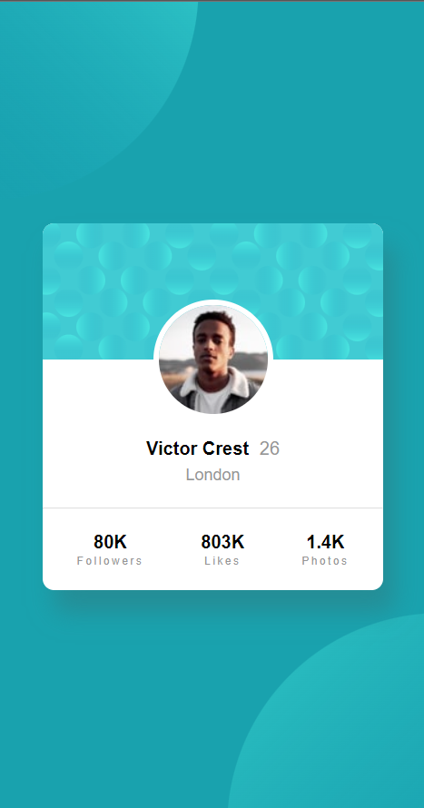

# Frontend Mentor - 3-column preview card component solution

This is a solution to the [3-column preview card component challenge on Frontend Mentor](https://www.frontendmentor.io/challenges/3column-preview-card-component-pH92eAR2-). Frontend Mentor challenges help you improve your coding skills by building realistic projects.

## Table of contents

-   [Overview](#overview)
    -   [The challenge](#the-challenge)
    -   [Screenshot](#screenshot)
    -   [Links](#links)
-   [My process](#my-process)
    -   [Built with](#built-with)
    -   [What I learned](#what-i-learned)
-   [Author](#author)

## Overview

### The challenge

-   Build out the project to the designs provided

### Screenshot



### Links

-   Solution URL: [Solution URL](https://www.frontendmentor.io/challenges/profile-card-component-cfArpWshJ/hub)
-   Live Site URL: [Live Site](https://jp-profile-card-component-main.netlify.app/)

## My process

### Built with

-   Semantic HTML5 markup
-   CSS custom properties
-   Flexbox
-   Mobile-first workflow

### What I learned

I actually had a lot of trouble trying to position both svg circles on the background. I ended up using this solution:

```css
.background {
	background-image: url('images/bg-pattern-top.svg'),
		url('images/bg-pattern-bottom.svg');
	background-repeat: no-repeat;
	background-size: contain;
	background-position: top -200px left -200px, bottom -200px right -200px;
}
```

The tricky part I found was with the background-position property. Instead of just setting "top left" and "bottom right", I had to specify offset values on top of that to match the design given.

## Author

-   Website - [João P. Kiyoshi](https://joaopkiyoshi.netlify.app/)
-   Frontend Mentor - [@jpkiyoshi](https://www.frontendmentor.io/profile/jpkiyoshi)
-   Twitter - [@jpkiyoshi](https://twitter.com/jpkiyoshi)
